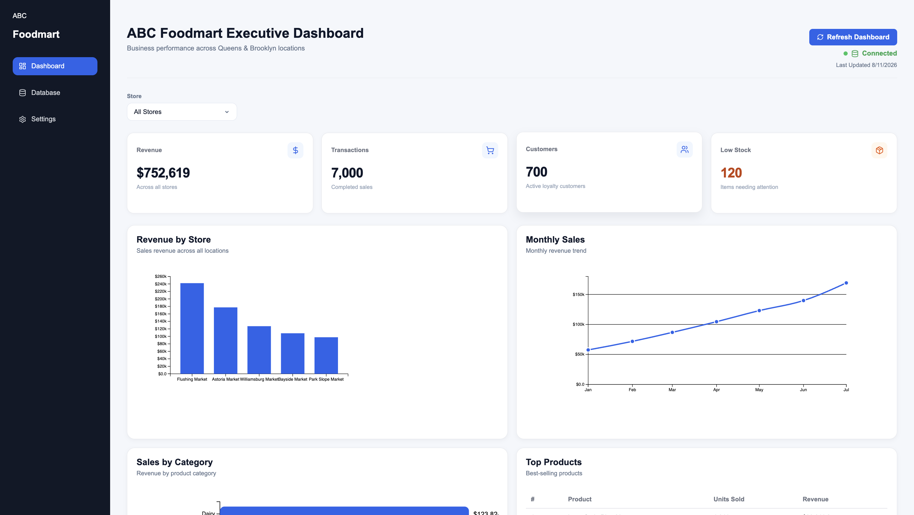
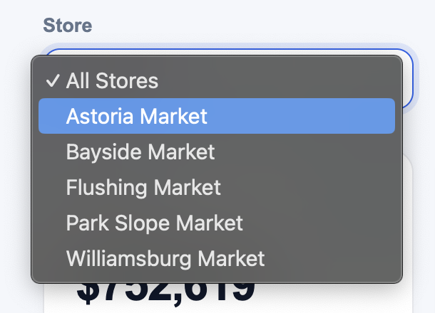
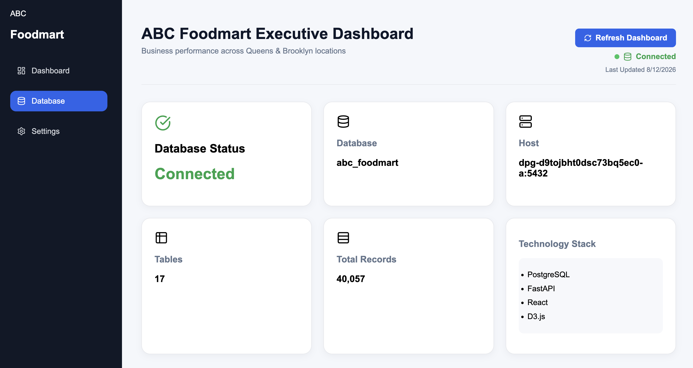

# ABC Foodmart Dashboard

A React + TypeScript dashboard developed for the ABC Foodmart Database Systems project. The dashboard provides executives with interactive visualizations and key business metrics powered by a PostgreSQL database through a FastAPI backend.

---

## Features

- Executive dashboard
- Revenue by Store
- Monthly Sales Trends
- Sales by Category
- Top Selling Products
- Inventory Alerts
- Vendor Performance
- Store Filter
- Database Status Page
- Responsive user interface

---

## Technology Stack

- React
- TypeScript
- Vite
- D3.js
- React Router
- Lucide React
- FastAPI (Backend API)
- PostgreSQL

---

## Project Structure

```
src/
│
├── components/
│   ├── charts/
│   ├── dashboard/
│   ├── layout/
│   └── tables/
│
├── context/
│
├── pages/
│
├── services/
│
├── styles/
│
├── types/
│
└── App.tsx
```

---

## Installation

Clone the repository

```bash
git clone https://github.com/YOUR-USERNAME/ABC-Foodmart.git
```

Install dependencies

```bash
npm install
```

Create a `.env` file

```env
VITE_API_URL=http://localhost:8000/api
```

For production:

```env
VITE_API_URL=https://your-api.onrender.com/api
```

Start the development server

```bash
npm run dev
```

---

## Production Build

```bash
npm run build
```

---

## Dashboard Features

### Revenue by Store

Displays total revenue generated by each store location.

### Monthly Sales

Shows monthly sales trends to identify seasonality.

### Sales by Category

Visualizes revenue by product category.

### Top Products

Lists the highest-selling products.

### Inventory Alerts

Displays products that require restocking.

### Vendor Performance

Compares vendor performance based on supplied products.

### Store Filter

Allows users to view metrics for a specific store.

### Database Status

Displays information about the connected PostgreSQL database.

---

## Deployment

Frontend deployed using:

- GitHub Pages

Backend:

- FastAPI
- Render

Database:

- PostgreSQL on Render

---

## Screenshots

### Dashboard



### Filters



### Database Status


